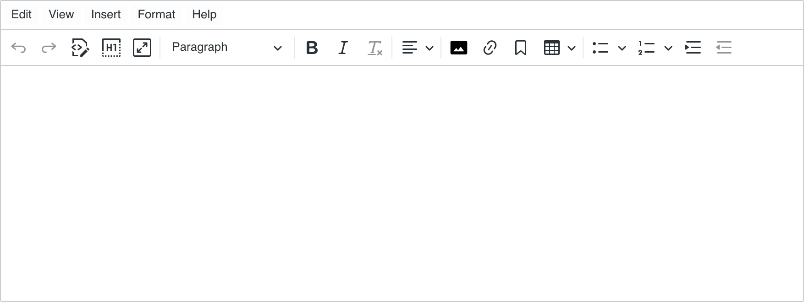
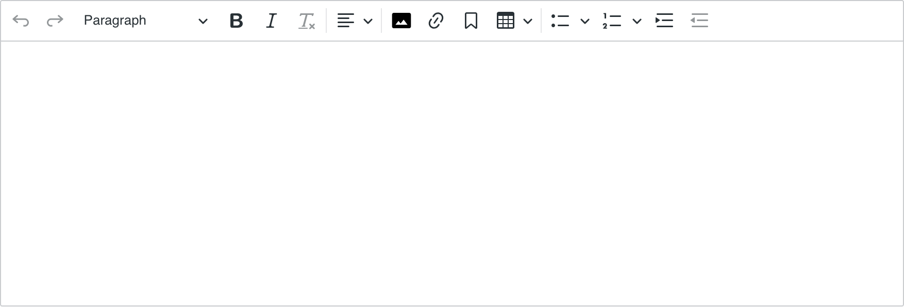
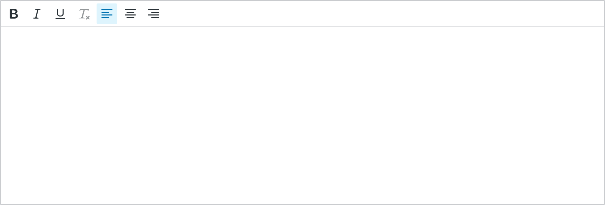
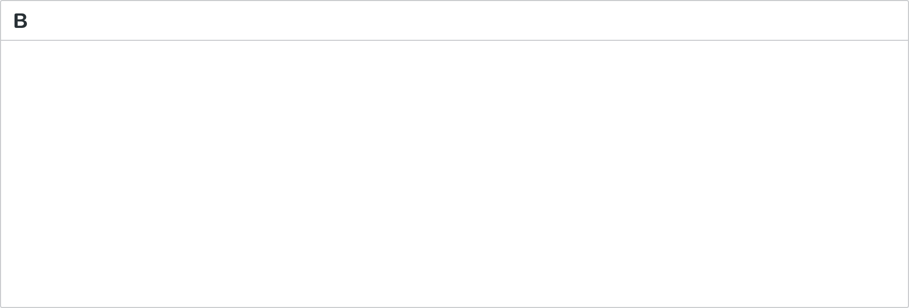

---
page:
  '$path': '/sites/academy/home/documentation/jahia/8_2/developer/extending-and-customizing-jahia-ui/configuring-and-customizing-ckeditor-menu/ckeditor-5'
  'jcr:title': CKEditor 5
  'j:templateName': documentation
content:
  '$subpath': document-area/content
---

This page provides information on how to configure, integrate and extend CKEditor 5 in Jahia. It explains how to work with the configuration file, how to create custom toolbars, how to apply custom toolbars to specific sites, permissions or content types.

## Installation

CK5 is available as a module. You can download it from the [Jahia Store](https://store.jahia.com/home.html).

Please note that CKEditor 5 will completely replace CKEditor 4 in a later version of Jahia, but for the time being both CK4 and CK5 can run at the same time on a Jahia environment. We've maintained this possibility to ease our customers' transition and training process of their users.

:::warning
CK4 is not supported anymore by its vendor, hence no bug fixes will be provided on this version, except for the parts that are specific to Jahia, if they are security related.
:::

### Initialization Behavior

Once the CK5 module is started, every new website created on the platform will use CK5 by default. All previously existing websites are automatically added in a list of exclusions, to let users continue to use CK4 and not force any change on the platform.

To activate CK5 on a pre-existing website, the first thing to do is to remove this site from the exclude list in the cfg file.

## Configuration

A configuration is the name given to a specific CK5 toolbar and its underlying plugins.

Jahia provides four configurations (`minimal`, `light`, `advanced` and `complete`) aiming to satisfy most editorial teams. To ease maintenance and governance, those configurations should not be modified. **You can create and deploy your own configurations to match your needs.**

Here are screenshots of the four default configurations:

1. **Complete:** interface visible by default to editors with the `view-full-wysiwyg-editor` permission (can be overriden with `richtext[ckeditor.customConfig='complete']` in CND)

   

2. **Advanced:** interface visible by default to editors with the `view-basic-wysiwyg-editor` permission (can be overriden with `richtext[ckeditor.customConfig='advanced']` in CND)

   

3. **Light:** interface visible by default to editors with the `view-light-wysiwyg-editor` permission (can be overriden with `richtext[ckeditor.customConfig='light']` in CND)

   

4. **Minimal:** interface visible by default to all other contributors (can be overriden with `richtext[ckeditor.customConfig='minimal']` in CND)

   

### Configuration Registration

The goal of this section is to give a good understanding of how configurations are registered and where they are kept in order to make them editable.

:::info
If you are working on a module using the [Jahia UI extensions tech stack](/cms/{mode}/{lang}/sites/academy/home/documentation/jahia/8_2/developer/extending-and-customizing-jahia-ui/jahia-ui-under-the-hood.html), you can import and use `registry` from the `@jahia/ui-extender` package instead of accessing it from `window`. [Get started with UI extensions.](/cms/{mode}/{lang}/sites/academy/home/documentation/jahia/8_2/developer/extending-and-customizing-jahia-ui/extending-jahia-ui.html)

If you intend to import official `ckeditor5` packages from npm within your module, you'll need to register them as both `sharedDeps` and `singletonDeps` in your `webpack.shared.js` configuration file.
:::

CKEditor 5-related settings can be found in the registry under three types:

- `@jahia/ckeditor5`: exposes a `defineConfig` helper to register custom configurations.

  Here's how to use `defineConfig` to create a new toolbar:

  ```javascript
  // 1. Define custom configuration
  const customConfig = {
    // See below for examples
  };

  // 2. Register your configuration under the `customConfig` name
  const ckeditor5 = window.jahia.uiExtender.registry.get('@jahia/ckeditor5', 'shared');
  ckeditor5.defineConfig('customConfig', customConfig);
  ```

- `ckeditor5-config`: exposes toolbars registered for all default and custom configurations. When you register your configuration using `defineConfig` it will be available for your specific key under this type.
- `ckeditor5-plugins`: exposes plugins registered for all default and custom configurations. Similarly to ckeditor5-config, the plugins used by your custom toolbar will be found under that type.

The initialization of the default toolbars happens on the `jahiaApp-init:99` hook, use `99.5` to access the default toolbars when defining your own:

```javascript
window.jahia.uiExtender.registry.add('callback', 'test-ckeditor5-configExample', {
  targets: ['jahiaApp-init:99.5'],
  callback: function () {
    // Register custom toolbars here
  },
});
```

Here's how you can quickly define a simple custom config by relying on existing registrations to avoid importing a lot of custom classes:

```javascript
/** A custom configuration with only the bold button */
const boldOnly = {
  // Inherit plugins and config from the minimal configuration
  ...window.jahia.uiExtender.registry.get('ckeditor5-plugins', 'minimal'),
  ...window.jahia.uiExtender.registry.get('ckeditor5-config', 'minimal'),
  // Override toolbar to have only the bold button
  toolbar: {
    items: ['bold'],
  },
};

const ckeditor5 = window.jahia.uiExtender.registry.get('@jahia/ckeditor5', 'shared');
ckeditor5.defineConfig('boldOnly', boldOnly);
```

Your custom toolbar can now be applied using `richtext[ckeditor.customConfig='boldOnly']` in your CND or via the configuration file as described below. The result is rather minimal:



:::info
The CKEditor website has an interactive tool to create custom configurations: [CK5 builder tool](https://ckeditor.com/ckeditor-5/builder/).
:::

### Applying a Configuration

This section demonstrates the ways in which CK 5 configuration can be applied in Jahia.

#### Global Configuration File

The global configuration file allows you to have control over what toolbar is displayed on what site and under what conditions.

```yaml
includeSites:
  - site1
  - site2
excludeSites:
  # This list is automatically populated when CK5 module is installed with pre-existing sites
  - site3
  - site4
```

Ensure that the target site is not listed under `excludeSites` when modifying other sections of the configuration file.

There are several ways to apply specific configuration:

- Global: Configuration can be applied across all sites
- Site-specific: Configuration can be applied only to specific sites
- Permission-based: can be combined with 1 or 2 to determine if configuration can be applied

Global configuration can be applied simply by adding the name of the configuration in the configs list:

```yaml
configs:
  - name: yourConfig
```

This will apply a config named `yourConfig` to all sites. Note that you still need to follow the steps in the first section to define your configuration.

To apply configuration to specific sites, add an optional siteKeys list:

```yaml
configs:
  - siteKeys:
      - siteKey1
      - siteKey2
    name: yourConfig
```

If you want to check for permission add an optional permission parameter:

```yaml
configs:
  - siteKeys:
      - siteKey1
      - siteKey2
    name: yourConfig
    permission: myPermission
```

The configuration order is important:

- Configurations that have `siteKeys` will be processed first.
- Configurations without `siteKeys` will be processed afterwards.

Apart from this site key ordering, the first configuration that satisfies all configuration requirements will be used.

**Set the most powerful toolbars first,** so that users with broader permissions do not get matched to configurations intended for more restricted roles.

#### CND configuration

Configuration can also be defined at the CND level. In this case, the configuration is applied directly to the specified field within the content definition, overriding any global or site-specific configuration.

```
[example:article]
 - body (string, richtext[ckeditor.customConfig='yourConfig'])
```

CND-level configuration does not support permissions or site keys. The specified configuration is always applied directly to the field.

#### JSON Overrides

Another way to apply configuration is by using a JSON override. JSON override can be deployed with a module, it could be your template-set for example.

To do so, you need to create a file under `META_INF/jahia-content-editor-forms/fieldsets` with the following content:

```json
{
  "name": "example:article",
  "priority": 1.1,
  "fields": [
    {
      "name": "body",
      "selectorOptionsMap": {
        "ckeditor": {
          "customConfig": "yourConfig"
        }
      }
    }
  ]
}
```

This will apply yourConfig to the body field on the `example:article` definition.

Configurations defined in the configuration file will have lower priority than the ones defined at the CND level, and JSON overrides will have the ability to change configuration at the CND level.

### Bundled Plugins and Features

The CK5 module packs many free and premium features of CKEditor 5, some of them are not visible in our default toolbars but still available for integration. For instance, because code blocks require specific scripting and styling in the integration, they have not been included in the default toolbars, but the button can still be added to a custom configuration:

```javascript
// This custom toolbar inherits the `complete` configuration
const completeConfig = registry.get('ckeditor5-config', 'complete');

/** A complex toolbar for developer documentation */
const academyToolbar = {
  // Inherit plugins and config from the complete configuration
  ...registry.get('ckeditor5-plugins', 'complete'),
  ...completeConfig,
  toolbar: {
    items: completeConfig.toolbar.items.toSpliced(
      // Add the `codeBlock` button right after the `insertTable` button
      completeConfig.toolbar.items.indexOf('insertTable') + 1,
      0,
      'codeBlock'
    ),
    shouldNotGroupWhenFull: true,
  },
  codeBlock: {
    // List of languages visible in the code block dropdown
    languages: [
      { language: 'css', label: 'CSS' },
      { language: 'html', label: 'HTML' },
    ],
  },
};

const ckeditor5 = registry.get('@jahia/ckeditor5', 'shared');
ckeditor5.defineConfig('academyToolbar', academyToolbar);
```


This toolbar can then be applied to the `academy` website using the configuration file:

```yaml
configs:
  - siteKeys:
      - academy
    name: academyToolbar
```

The complete list of plugins available in the CK5 Jahia module [can be found on GitHub](https://github.com/Jahia/richtext-ckeditor5/blob/main/src/javascript/CKEditor/configurations/plugins-complete.js#L54).

The configuration of the `complete` toolbar [can also be found on GitHub](https://github.com/Jahia/richtext-ckeditor5/blob/main/src/javascript/CKEditor/configurations/config-complete.js).

### Premium Licence

The embedded version of CKEditor 5 includes a licence that covers the [Essential](https://ckeditor.com/ckeditor-5/capabilities/core-editing-features/) features, [Productivity](https://ckeditor.com/ckeditor-5/capabilities/productivity-features/) features and [AI Assistant](https://ckeditor.com/ckeditor-5/capabilities/ai-features/) features. This license applies to all Jahia modules, which means an integration can use those features in custom configurations, without any additional cost.

Collaboration features are not covered by this licence, neither File management (this is a feature of Jahia itself), nor Conversion and Embedding features.
