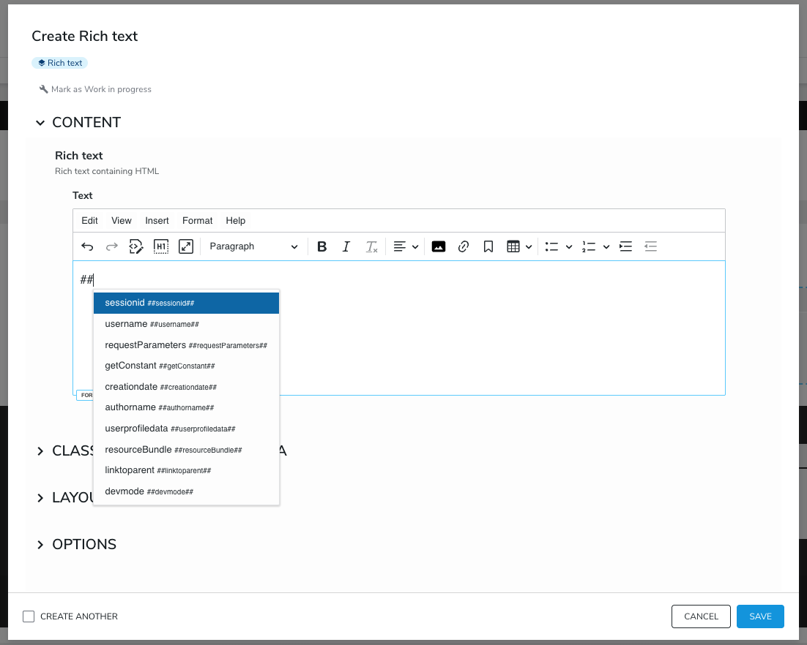
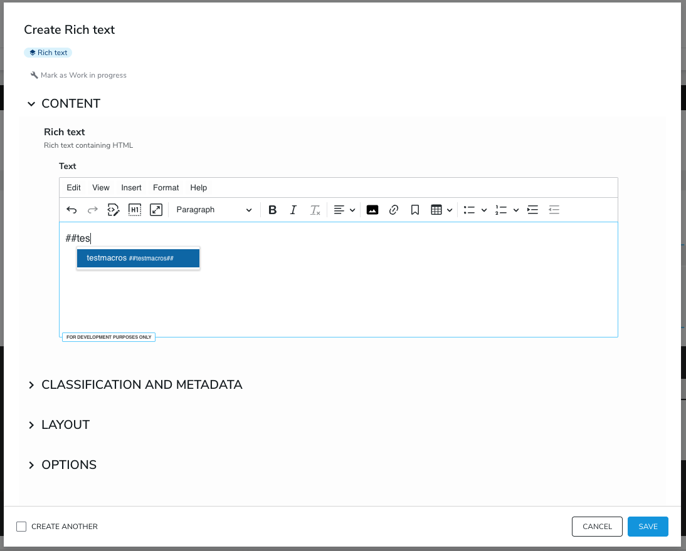

---
page:
  '$path': '/sites/academy/home/documentation/jahia/8_2/developer/extending-and-customizing-jahia-ui/configuring-and-customizing-ckeditor-menu/ckeditor-5/using-macros-in-ckeditor-5'
  'jcr:title': Using MACROS in CKEditor 5
  'j:templateName': documentation
content:
  '$subpath': document-area/content
---

## Selecting MACROS
CKEditor 5 supports MACROS out of the box, and no special effort, such as plugin installation, is required. Simply install CKEditor 5, create RichText content, and enter `##` in the editor to see the available suggestions. The list of suggestions will change as you modify the MACROS text.



## Adding New MACROS
To add new MACROS to CKEditor 5, simply add a Groovy script with the desired functionality to a module under `<your_module>/src/main/resources/WEB-INF/macros/testmacros.groovy` (example: [username.groovy](https://github.com/Jahia/macros/blob/eb69d4b9b657b1491b91dd4a50fa3b8cabc13841/src/main/resources/WEB-INF/macros/username.groovy)), deploy the module, and enable it on your site. Then, when you type `##tes`, you should see your MACROS in the suggestions. Simply select one, and when your RichText is rendered, it will replace the MACROS placeholder with whatever your Groovy file outputs.



You can learn more about MACROS by visiting [this link](https://academy.jahia.com/documentation/jahia-cms/jahia-7.3/developer/advanced-guides/customizing-the-interface-for-users/rendering-content#macros).

## Excluding MACROS

You may want to exclude certain macros from the list of suggestions. To do so, edit `org.jahia.modules.richtextCKEditor5.cfg` and update the `excludeMacros` list:

```aiignore
excludeMacros[0]=sessionid
```

## How MACROS Is Integrated
The MACROS functionality is made available with the help of the [mentions plugin](https://ckeditor.com/docs/ckeditor5/latest/features/mentions.html) provided by CKEditor. The following configuration is used to set it up:

```aiignore
mention: {
    feeds: [
        {
            marker: '##',
            feed: getFeedItems,
            itemRenderer: customItemRenderer
        }
    ]
}
```

Note that this means the marker `##` is reserved and should not be used with any other feed you might add to this configuration.
